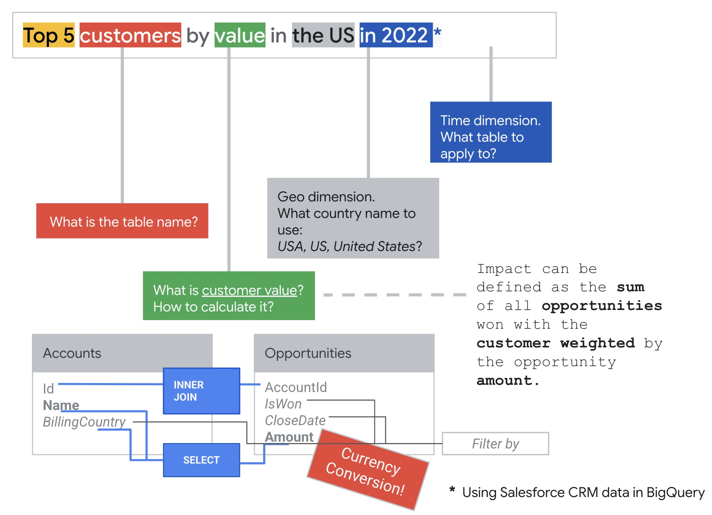
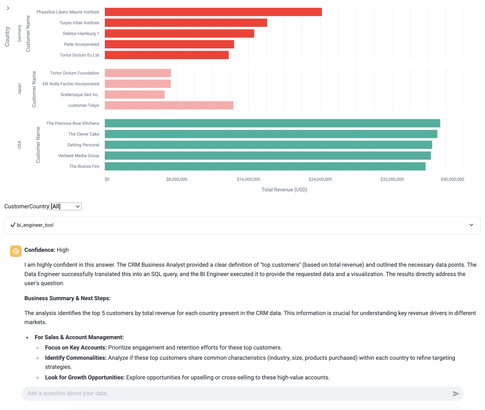
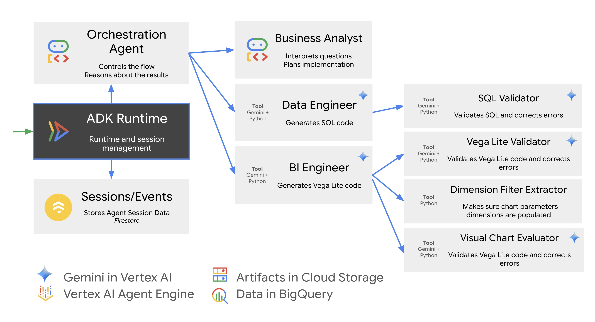

# CRM Data Q&A Agent - Advanced RAG with NL2SQL over Salesforce Data

This is a 📊 Data Analytics Agent that grounds its conversation in Salesforce data replicated to a Data Warehouse in [BigQuery](https://cloud.google.com/bigquery).

The agent demonstrates an advanced [Retrieval-Augmented Generation](https://cloud.google.com/use-cases/retrieval-augmented-generation) workflow
in a multi-agentic system with contextualized Natural-Language-to-SQL
components powered by Long Context and In-Context Learning capabilities of [Gemini 2.5 Pro](https://deepmind.google/technologies/gemini).

The agent is built with [Google Agent Development Kit](https://google.github.io/adk-docs/).

* The agent interprets questions about state of the business how it's reflected in CRM rather than directly referring to Salesforce data entities.
* It generates SQL query to gather data necessary for answering the question
* It creates interactive [Vega-Lite 4](https://vega.github.io/vega-lite-v4/) diagrams.
* It analyzes the results, provides key insights and recommended actions.

## Google Agent Development Kit


The agent is built using [Agent Development Kit](https://google.github.io/adk-docs/) (ADK) - a flexible
and modular framework for developing and deploying AI agents.

The sample also demonstrates:

* How to build a Web UI for ADK-based data agents using [streamlit](https://streamlit.io/).
* How to use [Artifact Services](https://google.github.io/adk-docs/artifacts/) with ADK.
* How to stream and interpret session [events](https://google.github.io/adk-docs/events/).
* How to create and use a custom [Session Service](https://google.github.io/adk-docs/sessions/session/).

## 🕵🏻‍♀️ Simple questions are complex



### Examples of questions the agent can answer

* "Top 5 customers in every country"
* "What are our best lead sources?"
  * or more specific "What are our best lead sources by value?"
* Lead conversion trends in the US.

### Screenshot

<a href="tutorial/img/top_5_customers_screenshot.png">

</a>

### High-Level Design



## 🚀 Deploy and Run

To deploy the sample with demo data to a publicly available Cloud Run service,
use `Run on Google Cloud` button below.

[](https://deploy.cloud.run?git_repo=https://github.com/vladkol/crm-data-agent)

### Manual deployment

* Clone this repository:

```bash
git clone https://github.com/vladkol/crm-data-agent && cd crm-data-agent
```

* Create a Python virtual Environment

> [uv](https://docs.astral.sh/uv/) makes it easy: `uv venv .venv --python 3.11 && source .venv/bin/activate`

* Install dependencies

`pip install -r src/requirements.txt`

or, with `uv`:

`uv pip install -r src/requirements.txt`

* Create `.env` file in `src` directory. Set configuration values as described below.

> [src/.env-template](src/.env-template) is a template to use for your `.env` file.

### Configuration variables

> `src/.env` must be created and variables specified before taking further steps in deployment, local or cloud.

`GOOGLE_CLOUD_PROJECT` - [REQUIRED] Project Id of a Google Cloud Project that will be used with Vertex AI (and Cloud Run if deployed).

`GOOGLE_CLOUD_LOCATION` - [REQUIRED] Google Cloud Region to use with Vertex AI (and Cloud Run if deployed).

`AI_STORAGE_BUCKET` - [REQUIRED] Cloud Storage Bucket for ADK Asset Service and for staging Vertex AI assets.
Please create one.

`BQ_LOCATION` - [REQUIRED] BigQuery location of the Salesforce datasets.

`SFDC_BQ_DATASET` - [REQUIRED] Name of the Salesforce dataset (in project *SFDC_DATA_PROJECT_ID*).

`FIRESTORE_SESSION_DATABASE` - [REQUIRED] Name of a Firestore database. Please create one. ADK will store its session data here.

`BQ_PROJECT_ID` - *[OPTIONAL]* Project Id of a Google Cloud Project that will be used for running BigQuery query jobs. If not defined, `GOOGLE_CLOUD_PROJECT` value will be used.

`SFDC_DATA_PROJECT_ID` - *[OPTIONAL]* Project Id of a Google Cloud Project of the Salesforce dataset.
If not defined, `BQ_LOCATION` value will be used.

`SFDC_METADATA_FILE` - *[OPTIONAL]* Salesforce Metadata file (do not change this value if using the demo data).

> If you are deploying a demo, do not set `BQ_PROJECT_ID` and `SFDC_DATA_PROJECT_ID`.
> All resources will be created in GOOGLE_CLOUD_PROJECT project.

**If you deploy the agent to Cloud Run**, its service account must have the following roles:

* BigQuery Job User (`roles/bigquery.jobUser`) in BQ_PROJECT_ID project (or GOOGLE_CLOUD_PROJECT, if BQ_PROJECT_ID is not defined).
* BigQuery Data Viewer (`roles/bigquery.dataViewer`) for SFDC_BQ_DATASET dataset.
* Storage Object User (`roles/storage.objectUser`) for AI_STORAGE_BUCKET bucket.
* Vertex AI User (`roles/aiplatform.user`) in GOOGLE_CLOUD_PROJECT project.

### Enable APIs in your project

```bash
gcloud services enable \
    aiplatform.googleapis.com \
    cloudbuild.googleapis.com \
    run.googleapis.com \
    firestore.googleapis.com \
    bigquery.googleapis.com \

    --project=[GOOGLE_CLOUD_PROJECT]
```

> Replace `[GOOGLE_CLOUD_PROJECT]` with GOOGLE_CLOUD_PROJECT value you put in `src/.env` file.

### Deploy Salesforce Data

#### Demo data

Run `utils/deploy_demo_data.py` script.

> **Note**: Demo data contains records dated 2020-2022. If you ask questions with "last year" or "6 months ago", they will likely return no data.

#### Real Salesforce Data

Create a [BigQuery Data Transfer for Salesforce](https://cloud.google.com/bigquery/docs/salesforce-transfer).

Make sure you transfer the following objects:

* Account
* Case
* CaseHistory
* Contact
* CurrencyType
* DatedConversionRate
* Event
* Lead
* Opportunity
* OpportunityHistory
* RecordType
* Task
* User

#### Deployment with your custom Salesforce.com metadata

*COMING SOON!*

This will allow you to use your customized metadata in addition to analyzing your real data replicated to BigQuery.

### Run Locally

* Run `.\run_local.sh`
* Open `http://localhost:8080` in your browser.

#### Deploy and Run in Cloud Run

* Run `.\deploy_to_cloud_run.sh`

> This deployment uses default Compute Service Account for Cloud Run.
To make changes in how the deployment is done, adjust `gcloud` command in [deploy_to_cloud_run.py](utils/deploy_to_cloud_run.py)

**Cloud Run Authentication Note**:

By default, this script deploys a Cloud Run service that requires authentication.
You can switch to unauthenticated mode in [Cloud Run](https://console.cloud.google.com/run) or configure a [Load Balancer and Identity Access Proxy](https://cloud.google.com/iap/docs/enabling-cloud-run) (recommended).

## 📃 License

This repository is licensed under the Apache 2.0 License - see the [LICENSE](LICENSE) file for details.

## 🗒️ Disclaimers

This is not an officially supported Google product. This project is not eligible for the [Google Open Source Software Vulnerability Rewards Program](https://bughunters.google.com/open-source-security).

Code and data from this repository are intended for demonstration purposes only. It is not intended for use in a production environment.
